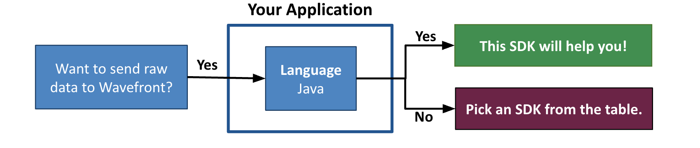

# wavefront-sdk-java [![build status][ci-img]][ci] [![Released Version][maven-img]][maven]

## Table of Content
* [Prerequisites](#Prerequisites)
* [Set Up a WavefrontSender](#set-up-a-wavefrontsender)
* [Send Data to Wavefront](#send-data-to-wavefront)
* [Close the WavefrontSender](#close-the-wavefrontsender)
* [Monitor the SDK](#monitor-the-sdk)
* [License](#License)
* [How to Contribute](#How-to-Contribute)

# Welcome to Wavefront's Java SDK

Wavefront by VMware Java SDK lets you send raw data from your Java application to Wavefront using a `WavefrontSender` interface. The data is then stored as metrics, histograms, and trace data. This SDK is also referred to as the Wavefront Sender SDK for Java. 

Although this library is mostly used by the other Wavefront Java SDKs to send data to Wavefront, you can also use this SDK directly. For example, you can send data directly from a data store or CSV file to Wavefront.

**Before you start implementing, let us make sure you are using the correct SDK!**



> ***Note***:
> </br>
>   * **This is the Wavefront by VMware SDK for Java (Wavefront Sender SDK for Java)!**
>   If this SDK is not what you were looking for, see the [table](#wavefront-sdks) below.

#### Wavefront SDKs
<table id="SDKlevels" style="width: 100%">
<tr>
  <th width="10%">SDK Type</th>
  <th width="45%">SDK Description</th>
  <th width="45%">Supported Languages</th>
</tr>

<tr>
  <td><a href="https://docs.wavefront.com/wavefront_sdks.html#sdks-for-collecting-trace-data">OpenTracing SDK</a></td>
  <td align="justify">Implements the OpenTracing specification. Lets you define, collect, and report custom trace data from any part of your application code. <br>Automatically derives Rate Errors Duration (RED) metrics from the reported spans. </td>
  <td>
    <ul>
    <li>
      <b>Java</b>: <a href ="https://github.com/wavefrontHQ/wavefront-opentracing-sdk-java">OpenTracing SDK</a> <b>|</b> <a href ="https://github.com/wavefrontHQ/wavefront-opentracing-bundle-java">Tracing Agent</a>
    </li>
    <li>
      <b>Python</b>: <a href ="https://github.com/wavefrontHQ/wavefront-opentracing-sdk-python">OpenTracing SDK</a>
    </li>
    <li>
      <b>Go</b>: <a href ="https://github.com/wavefrontHQ/wavefront-opentracing-sdk-go">OpenTracing SDK</a>
    </li>
    <li>
      <b>.Net/C#</b>: <a href ="https://github.com/wavefrontHQ/wavefront-opentracing-sdk-csharp">OpenTracing SDK</a>
    </li>
    </ul>
  </td>
</tr>

<tr>
  <td><a href="https://docs.wavefront.com/wavefront_sdks.html#sdks-for-collecting-metrics-and-histograms">Metrics SDK</a></td>
  <td align="justify">Implements a standard metrics library. Lets you define, collect, and report custom business metrics and histograms from any part of your application code.   </td>
  <td>
    <ul>
    <li>
    <b>Java</b>: <a href ="https://github.com/wavefrontHQ/wavefront-dropwizard-metrics-sdk-java">Dropwizard</a> <b>|</b> <a href ="https://github.com/wavefrontHQ/wavefront-runtime-sdk-jvm">JVM</a>
    </li>
    <li>
    <b>Python</b>: <a href ="https://github.com/wavefrontHQ/wavefront-pyformance">Pyformance SDK</a>
    </li>
    <li>
      <b>Go</b>: <a href ="https://github.com/wavefrontHQ/go-metrics-wavefront">Go Metrics SDK</a>
      </li>
    <li>
    <b>.Net/C#</b>: <a href ="https://github.com/wavefrontHQ/wavefront-appmetrics-sdk-csharp">App Metrics SDK</a>
    </li>
    </ul>
  </td>
</tr>

<tr>
  <td><a href="https://docs.wavefront.com/wavefront_sdks.html#sdks-that-instrument-frameworks">Framework SDK</a></td>
  <td align="justify">Reports predefined traces, metrics, and histograms from the APIs of a supported app framework. Lets you get started quickly with minimal code changes.</td>
  <td>
    <ul>
    <li><b>Java</b>:
    <a href="https://github.com/wavefrontHQ/wavefront-dropwizard-sdk-java">Dropwizard</a> <b>|</b> <a href="https://github.com/wavefrontHQ/wavefront-gRPC-sdk-java">gRPC</a> <b>|</b> <a href="https://github.com/wavefrontHQ/wavefront-jaxrs-sdk-java">JAX-RS</a> <b>|</b> <a href="https://github.com/wavefrontHQ/wavefront-jersey-sdk-java">Jersey</a></li>
    <li><b>.Net/C#</b>:
    <a href="https://github.com/wavefrontHQ/wavefront-aspnetcore-sdk-csharp">ASP.Net core</a> </li>
    <!--- [Python](wavefront_sdks_python.html#python-sdks-that-instrument-frameworks) --->
    </ul>
  </td>
</tr>

<tr>
  <td><a href="https://docs.wavefront.com/wavefront_sdks.html#sdks-for-sending-raw-data-to-wavefront">Sender SDK</a></td>
  <td align="justify">Lets you send raw data to Wavefront for storage as metrics, histograms, or traces, e.g., to import CSV data into Wavefront.
  </td>
  <td>
    <ul>
    <li>
    <b>Java</b>: <a href ="https://github.com/wavefrontHQ/wavefront-sdk-java">Sender SDK</a>
    </li>
    <li>
    <b>Python</b>: <a href ="https://github.com/wavefrontHQ/wavefront-sdk-python">Sender SDK</a>
    </li>
    <li>
    <b>Go</b>: <a href ="https://github.com/wavefrontHQ/wavefront-sdk-go">Sender SDK</a>
    </li>
    <li>
    <b>.Net/C#</b>: <a href ="https://github.com/wavefrontHQ/wavefront-sdk-csharp">Sender SDK</a>
    </li>
    <li>
    <b>C++</b>: <a href ="https://github.com/wavefrontHQ/wavefront-sdk-cpp">Sender SDK</a>
    </li>
    </ul>
  </td>
</tr>

</tbody>
</table>

## Prerequisites

* Java 8 or above.
* Add dependencies:
  * **Maven** <br/>
    If you are using Maven, add the following maven dependency to your pom.xml:
    ```
    <dependency>
        <groupId>com.wavefront</groupId>
        <artifactId>wavefront-sdk-java</artifactId>
        <version>$releaseVersion</version>
    </dependency>
    ```
    Replace `$releaseVersion` with the latest version available on [maven].

  * **Gradle** <br/>
    If you are using Gradle, add the following dependency:
    ```
    compile group: 'com.wavefront', name: 'wavefront-sdk-java', version: '$releaseVersion'
    ```
    Replace `$releaseVersion` with the latest version available on [maven].

## Set Up a WavefrontSender

You can send metrics, histograms, or trace data from your application to the Wavefront service using a Wavefront proxy or direct ingestions.

* Use a [**Wavefront proxy**](https://docs.wavefront.com/proxies.html), which then forwards the data to the Wavefront service. This is the recommended choice for a large-scale deployment that needs resilience to internet outages, control over data queuing and filtering, and more.
* Use [**direct ingestion**](https://docs.wavefront.com/direct_ingestion.html) to send the data directly to the Wavefront service. This is the simplest way to get up and running quickly.

[Create a `WavefrontClient`](#Sending-Data-via-the-WavefrontClient) to send data to Wavefront either via Wavefront proxy or directly over HTTP.

> **Deprecated implementations**: *`WavefrontDirectIngestionClient` and `WavefrontProxyClient` are deprecated. We recommend all new applications to use the `WavefrontClient`.*

### Sending Data via the WavefrontClient

Use `WavefrontClientFactory` to create a `WavefrontClient` instance, which can send data directly to a Wavefront service or send data using a Wavefront Proxy.

The `WavefrontClientFactory` supports multiple client bindings. If more than one client configuration is specified, you can create a `WavefrontMultiClient` to send multiple Wavefront services.

#### Prerequisites  
* Sending data via Wavefront proxy? 
  <br/>Before your application can use a `WavefrontClient` you must [set up and start a Wavefront proxy](https://docs.wavefront.com/proxies_installing.html).  
* Sending data via direct ingestion? 
  * Verify that you have the Direct Data Ingestion permission. For details, see [Examine Groups, Roles, and Permissions](https://docs.wavefront.com/users_account_managing.html#examine-groups-roles-and-permissions).
  * The URL of your Wavefront instance. This is the URL you connect to when you log in to Wavefront, typically something like `https://<domain>.wavefront.com`.
  * [Obtain the API token](http://docs.wavefront.com/wavefront_api.html#generating-an-api-token).

#### Initialize the WavefrontClient

You initialize a `WavefrontClient` by building it with the information you obtained in the Prerequisites section.

Optionally, you can call factory methods to tune the following ingestion properties:

* Max queue size - Internal buffer capacity of the `WavefrontSender`. Data that exceeds this size is dropped.
* Flush interval - Interval for flushing data from the `WavefrontSender` directly to Wavefront.
* Batch size - Amount of data to send to Wavefront in each flush interval.

Together, the batch size and flush interval control the maximum theoretical throughput of the `WavefrontSender`. Override the defaults _only_ to set higher values.

**Example**: Sending data to Wavefront via the Wavefront Proxy
```java
// Add a client with the following URL format: "proxy://<your.proxy.load.balancer>.com"
// to send data to proxies
WavefrontClientFactory wavefrontClientFactory = new WavefrontClientFactory();
wavefrontClientFactory.addClient(wavefrontURL)

WavefrontSender wavefrontSender = wavefrontClientFactory.getClient();
```

**Example**: Sending data to Wavefront via direct ingestion
```java
// Create a factory and add a client with the following URL format: "https://TOKEN@DOMAIN.wavefront.com"
// and a Wavefront API token with direct ingestion permission
WavefrontClientFactory wavefrontClientFactory = new WavefrontClientFactory();

// Add a new client that sends data directly to Wavefront services 
wavefrontClientFactory.addClient(wavefrontURL,
  20_000,           // This is the max batch of data sent per flush interval
  100_000,          // This is the size of internal buffer beyond which data is dropped
  2,                // Together with the batch size controls the max theoretical throughput of the sender
  Integer.MAX_VALUE // The maximum message size in bytes we will push with on each flush interval 
);

WavefrontSender wavefrontSender = wavefrontClientFactory.getClient();
```
#### Sending data to multiple Wavefront services

Use `WavefrontMultiClient` to send data to multiple Wavefront services so you handle the data traffic.
The `addClient()` supports null for batch size, queue size, and push interval. The defaults values are used if nothing is specified.

**Example**: Creating a `WavefrontMultiClient` to send data to multiple Wavefront services.
```java
// Add multiple URLs to the Factory to obtain a multi-sender
WavefrontClientFactory wavefrontClientFactory = new WavefrontClientFactory();
wavefrontClientFactory.addClient("https://someToken@DOMAIN.wavefront.com");
wavefrontClientFactory.addClient("proxy://our.proxy.lb.com:2878");

WavefrontSender wavefrontSender = wavefrontClientFactory.getClient();
```

```java
// Using the WavefrontClient.Builder directly with a url in the form of "https://DOMAIN.wavefront.com"
// and a Wavefront API token with direct ingestion permission
WavefrontClient.Builder wfClientBuilder = new WavefrontClient.Builder(wavefrontURL, token)

// This is the size of internal buffer beyond which data is dropped
// Optional: Set this to override the default max queue size of 50,000
wfClientBuilder.maxQueueSize(100_000);

// This is the max batch of data sent per flush interval
// Optional: Set this to override the default batch size of 10,000
wfClientBuilder.batchSize(20_000);

// Together with batch size controls the max theoretical throughput of the sender
// Optional: Set this to override the default flush interval value of 1 second
wfClientBuilder.flushIntervalSeconds(2);

WavefrontSender wavefrontSender = wfClientBuilder.build();
``` 

```java
// Using the WavefrontClient.Builder directly with a url in the form of "http://your.proxy.load.blanacer:port"
// to send data to proxies.
WavefrontClient.Builder wfClientBuilder = new WavefrontClient.Builder(proxyURL)

// This is the size of internal buffer beyond which data is dropped
// Optional: Set this to override the default max queue size of 50,000
wfClientBuilder.maxQueueSize(100_000);

// This is the max batch of data sent per flush interval
// Optional: Set this to override the default batch size of 10,000
wfClientBuilder.batchSize(20_000);

// Together with batch size controls the max theoretical throughput of the sender
// Optional: Set this to override the default flush interval value of 1 second
wfClientBuilder.flushIntervalSeconds(2);

WavefrontSender wavefrontSender = wfClientBuilder.build();
``` 

## Send Data to Wavefront

 Wavefront supports different metric types, such as gauges, counters, delta counters, histograms, traces, and spans. See [Metrics](https://docs.wavefront.com/metric_types.html) for details. To send data to Wavefront using the `WavefrontSender` you need to instantiate the following:
 * [Metrics and Delta Counters](#Metrics-and-Delta-Counters)
 * [Distributions (Histograms)](#Distributions-(Histograms))
 * [Tracing Spans](#Tracing-Spans)

#### Metrics and Delta Counters

 ```java
// Wavefront Metrics Data format
// <metricName> <metricValue> [<timestamp>] source=<source> [pointTags]
// Example: "new-york.power.usage 42422 1533529977 source=localhost datacenter=dc1"
wavefrontSender.sendMetric("new-york.power.usage", 42422.0, 1533529977L,
    "localhost", ImmutableMap.<String, String>builder().put("datacenter", "dc1").build());

// Wavefront Delta Counter format
// <metricName> <metricValue> source=<source> [pointTags]
// Example: "lambda.thumbnail.generate 10 source=lambda_thumbnail_service image-format=jpeg"
wavefrontSender.sendDeltaCounter("lambda.thumbnail.generate", 10,
    "lambda_thumbnail_service",
    ImmutableMap.<String, String>builder().put("image-format", "jpeg").build());
```

#### Distributions (Histograms)

```java
// Wavefront Histogram Data format
// {!M | !H | !D} [<timestamp>] #<count> <mean> [centroids] <histogramName> source=<source>
// [pointTags]
// Example: You can choose to send to at most 3 bins: Minute, Hour, Day
// "!M 1533529977 #20 30.0 #10 5.1 request.latency source=appServer1 region=us-west"
// "!H 1533529977 #20 30.0 #10 5.1 request.latency source=appServer1 region=us-west"
// "!D 1533529977 #20 30.0 #10 5.1 request.latency source=appServer1 region=us-west"
wavefrontSender.sendDistribution("request.latency",
    ImmutableList.<Pair<Double, Integer>>builder().add(new Pair<>(30.0, 20)).
      add(new Pair<>(5.1, 10)).build(),
    ImmutableSet.<HistogramGranularity>builder().add(HistogramGranularity.MINUTE).
      add(HistogramGranularity.HOUR).
      add(HistogramGranularity.DAY).build(),
    1533529977L, "appServer1",
    ImmutableMap.<String, String>builder().put("region", "us-west").build());
```

#### Tracing Spans

```java
 // Wavefront Tracing Span Data format
 // <tracingSpanName> source=<source> [pointTags] <start_millis> <duration_milliseconds>
 // Example: "getAllUsers source=localhost
 //           traceId=7b3bf470-9456-11e8-9eb6-529269fb1459
 //           spanId=0313bafe-9457-11e8-9eb6-529269fb1459
 //           parent=2f64e538-9457-11e8-9eb6-529269fb1459
 //           application=Wavefront http.method=GET
 //           1552949776000 343"
wavefrontSender.sendSpan("getAllUsers", 1552949776000L, 343, "localhost",
      UUID.fromString("7b3bf470-9456-11e8-9eb6-529269fb1459"),
      UUID.fromString("0313bafe-9457-11e8-9eb6-529269fb1459"),
      ImmutableList.<UUID>builder().add(UUID.fromString(
        "2f64e538-9457-11e8-9eb6-529269fb1459")).build(), null,
      ImmutableList.<Pair<String, String>>builder().
        add(new Pair<>("application", "Wavefront")).
        add(new Pair<>("http.method", "GET")).build(), null);
```

## Close the WavefrontSender
Remember to flush the buffer and close the sender before shutting down your application.
```java
// If there are any failures observed while sending metrics/histograms/tracing-spans above,
// you get the total failure count using the below API
int totalFailures = wavefrontSender.getFailureCount();

// on-demand buffer flush (may want to do this if you are shutting down your application)
wavefrontSender.flush();

// close the sender connection before shutting down application
// this will flush in-flight buffer and close connection
wavefrontSender.close();
```

## Monitor the SDK
See the [diagnostic metrics documentation](https://github.com/wavefrontHQ/wavefront-sdk-doc-sources/blob/master/java/internalmetrics.md#internal-diagnostic-metrics) for details on the internal metrics that the SDK collects and reports to Wavefront.

## License
[Apache 2.0 License](LICENSE).

## How to Contribute

* Reach out to us on our public [Slack channel](https://www.wavefront.com/join-public-slack).
* If you run into any issues, let us know by creating a GitHub issue.

[ci-img]: https://travis-ci.com/wavefrontHQ/wavefront-sdk-java.svg?branch=master
[ci]: https://travis-ci.com/wavefrontHQ/wavefront-sdk-java
[maven-img]: https://img.shields.io/maven-central/v/com.wavefront/wavefront-sdk-java.svg?maxAge=604800
[maven]: http://search.maven.org/#search%7Cga%7C1%7Cwavefront-sdk-java
